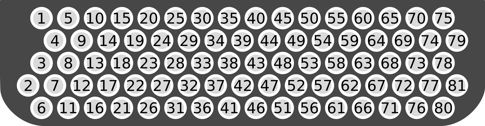

# Protocol between the Arduino and the Software
-----------

This protocol is designed to be less intensive on the Arduino side.

## MIDI messages used

The MIDI messages used for controlling the Arduino are SysEx messages.

Theses messages start with byte `11110000` (`0xF0`) and end with byte `11110111`

The first data byte (the manufacturer ID) is `0x7D`, usable for "prototyping, test, private use and experimentation".[1]

Every data byte in a SysEx message must begin with the bit `0`. Therefore, each
byte must be between 0 and 127.

The messages described here are thus in form:
```
0xF0
0x7D
XX
0xF7
```

With `XX` to be replaced by the bytes presented in the *format* part.

### Fetching the list of keyboard

The format to ask for the list of known keyboard is:
```
0x00
```

### Sending a keyboard to/from the Arduino EEPROM

If sent by the controller, the keyboard is stored on the Arduino EEPROM.
If sent by the Arduino, the keyboard is coming from the EEPROM and not currently
applied.

Format:
```
0x01
<type>
<name>
<data>
```
With:
- `type` the identifier of the type of keyboard (one byte). See
   [Keyboard types](#keyboard-types)
   section.
- `name` the name of the keyboard. As original name is a UTF-8 string, it must
be converted to 7-bit stream. We simply use base-64 encoding to send it.
- `data` the data of the keyboard. See [Keyboard types](#keyboard-types) section.

### Sending a keyboard to/from the Arduino RAM

If sent by the controller, the keyboard is applied as current.
If sent by the Arduino, the keyboard is currently applied. 

Format:
```
0x02
<type>
<name>
<data>
```
With:
- `type` the identifier of the type of keyboard (one byte). See
   [Keyboard types](#keyboard-types)
   section.
- `name` the name of the keyboard. As original name is a UTF-8 string, it must
be converted to 7-bit stream. We simply use base-64 encoding to send it.
- `data` the data of the keyboard. See [Keyboard types](#keyboard-types) section.

### Delete a keyboard

Can be sent only from the controller. Delete the keyboard
identified by its name.

Format:
```
0x04
<type>
<name>
```
With:
- `type` the identifier of the type of keyboard (one byte). See
   [Keyboard types](#keyboard-types)
   section.
- `name` the name of the keyboard. As original name is a UTF-8 string, it must
be converted to 7-bit stream. We simply use base-64 encoding to send it.

### Rename a keyboard

Can be sent only by the controller. Rename the keyboard identified by its
previous name.

Format:
```
0x08
<type>
<previous name>
<new name>
```
With:
- `type` the identifier of the type of keyboard (one byte). See
   [Keyboard types](#keyboard-types)
   section.
- `previous name` the previous name of the keyboard. As original name is a UTF-8
   string, it must be converted to 7-bit stream. We simply use base-64 encoding
   to send it.
- `new name` the new name of the keyboard. As original name is a UTF-8
   string, it must be converted to 7-bit stream. We simply use base-64 encoding
   to send it.

## Keyboard types

There are currently two types of keyboard:
1. Right keyboard with 81 buttons;
2. Left keyboard with 96 buttons.

### Right keyboard with 81 buttons
`type`: `0x01`  
`data`: `midi data`*81

The `data` field is a series of 81 contiguous `midi data`. It *matches* the
memory representation of the keyboard in the Arduino:
```
[midi data 1, midi data 2, ..., midi data 81]
```

The correspondence between the physical keyboard and the midi data array is:



### Left keyboard with 96 buttons
`type`: `0x02`  
`data`: `midi data`*96

The `data` field is a series of 96 contiguous `midi data`. It *matches* the
memory representation of the keyboard in the Arduino:
```
[midi data 1, midi data 2, ..., midi data 96]
```

The correspondence between the physical keyboard and the midi data array is:

## Midi data

The midi data field describe the action to perform when the corresponding key is
pressed.

Format:
```
<type>
<data>
```
With:
- `type` the type of midi data (one byte).
- `data` the data.

There are currently 3 types of midi data:
1. Note data;
2. Program data;
3. Control data.

### Note data

A note data represents a midi note.

`type`: `0x01`  
`data`: 
```
<channel>
<pitch>
<velocity> 
```
With:
- `channel` one byte from 0 to 15.
- `pitch` one byte from 0 to 127.
- `velocity` one byte from 0 to 127.

### Program data

A program data represents a midi program change message.

`type`: `0x02`  
`data`: 
```
<channel>
<program number> 
```
With:
- `channel` one byte from 0 to 15.
- `program number` one byte from 0 to 127.

### Control data

A control data represents a midi control change message.

`type`: `0x03`  
`data`: 
```
<channel>
<control number>
<value> 
```
With:
- `channel` one byte from 0 to 15.
- `control number` one byte from 0 to 127.
- `value` one byte from 0 to 127.


[1]: https://electronicmusic.fandom.com/wiki/List_of_MIDI_Manufacturer_IDs#Special_.2F_reserved_values